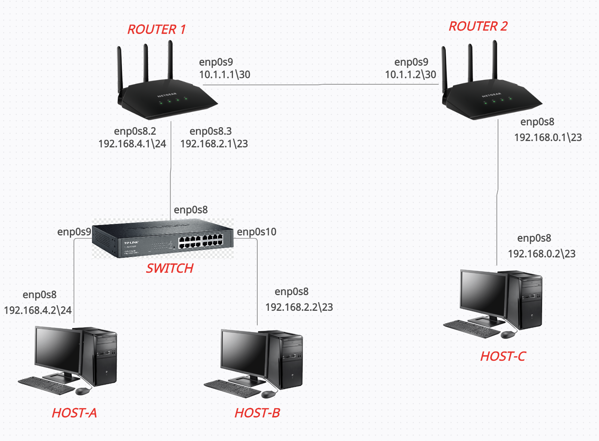

# DNCS-LAB

This repository contains the Vagrant files required to run the virtual lab environment used in the DNCS course.
```


        +-----------------------------------------------------+
        |                                                     |
        |                                                     |eth0
        +--+--+                +------------+             +------------+
        |     |                |            |             |            |
        |     |            eth0|            |eth2     eth2|            |
        |     +----------------+  router-1  +-------------+  router-2  |
        |     |                |            |             |            |
        |     |                |            |             |            |
        |  M  |                +------------+             +------------+
        |  A  |                      |eth1                       |eth1
        |  N  |                      |                           |
        |  A  |                      |                           |
        |  G  |                      |                     +-----+----+
        |  E  |                      |eth1                 |          |
        |  M  |            +-------------------+           |          |
        |  E  |        eth0|                   |           |  host-c  |
        |  N  +------------+      SWITCH       |           |          |
        |  T  |            |                   |           |          |
        |     |            +-------------------+           +----------+
        |  V  |               |eth2         |eth3                |eth0
        |  A  |               |             |                    |
        |  G  |               |             |                    |
        |  R  |               |eth1         |eth1                |
        |  A  |        +----------+     +----------+             |
        |  N  |        |          |     |          |             |
        |  T  |    eth0|          |     |          |             |
        |     +--------+  host-a  |     |  host-b  |             |
        |     |        |          |     |          |             |
        |     |        |          |     |          |             |
        ++-+--+        +----------+     +----------+             |
        | |                              |eth0                   |
        | |                              |                       |
        | +------------------------------+                       |
        |                                                        |
        |                                                        |
        +--------------------------------------------------------+


```

# Requirements
 - Python 3
 - 10GB disk storage
 - 2GB free RAM
 - Virtualbox
 - Vagrant (https://www.vagrantup.com)
 - Internet

# How-to
 - Install Virtualbox and Vagrant
 - Clone this repository
`git clone https://github.com/fabrizio-granelli/dncs-lab`
 - You should be able to launch the lab from within the cloned repo folder.
```
cd dncs-lab
[~/dncs-lab] vagrant up
```
Once you launch the vagrant script, it may take a while for the entire topology to become available.
 - Verify the status of the 4 VMs
 ```
 [dncs-lab]$ vagrant status                                                                                                                                                                
Current machine states:

router                    running (virtualbox)
switch                    running (virtualbox)
host-a                    running (virtualbox)
host-b                    running (virtualbox)
```
- Once all the VMs are running verify you can log into all of them:
`vagrant ssh router`
`vagrant ssh switch`
`vagrant ssh host-a`
`vagrant ssh host-b`
`vagrant ssh host-c`

# Assignment
This section describes the assignment, its requirements and the tasks the student has to complete.
The assignment consists in a simple piece of design work that students have to carry out to satisfy the requirements described below.
The assignment deliverable consists of a Github repository containing:
- the code necessary for the infrastructure to be replicated and instantiated
- an updated README.md file where design decisions and experimental results are illustrated
- an updated answers.yml file containing the details of your project

## Design Requirements
- Hosts 1-a and 1-b are in two subnets (*Hosts-A* and *Hosts-B*) that must be able to scale up to respectively 214 and 270 usable addresses
- Host 2-c is in a subnet (*Hub*) that needs to accommodate up to 348 usable addresses
- Host 2-c must run a docker image (dustnic82/nginx-test) which implements a web-server that must be reachable from Host-1-a and Host-1-b
- No dynamic routing can be used
- Routes must be as generic as possible
- The lab setup must be portable and executed just by launching the `vagrant up` command

## Tasks
- Fork the Github repository: https://github.com/fabrizio-granelli/dncs-lab
- Clone the repository
- Run the initiator script (dncs-init). The script generates a custom `answers.yml` file and updates the Readme.md file with specific details automatically generated by the script itself.
  This can be done just once in case the work is being carried out by a group of (<=2) engineers, using the name of the 'squad lead'. 
- Implement the design by integrating the necessary commands into the VM startup scripts (create more if necessary)
- Modify the Vagrantfile (if necessary)
- Document the design by expanding this readme file
- Fill the `answers.yml` file where required (make sure that is committed and pushed to your repository)
- Commit the changes and push to your own repository
- Notify the examiner (fabrizio.granelli@unitn.it) that work is complete specifying the Github repository, First Name, Last Name and Matriculation number. This needs to happen at least 7 days prior an exam registration date.

# Notes and References
- https://rogerdudler.github.io/git-guide/
- http://therandomsecurityguy.com/openvswitch-cheat-sheet/
- https://www.cyberciti.biz/faq/howto-linux-configuring-default-route-with-ipcommand/
- https://www.vagrantup.com/intro/getting-started/

# Design
- 214 indirizzi per host-A
- 270 indirizzi per host-B
- 348 indirizzi per host-C
- L'host-c deve essere in grado anche di far andare una docker image (dustnic82/nginx-test) la quale implementa un web-server che deve essere raggiungibile 
  dall'host-a e dall'host-b
- Non devono essere usate rotte dinamiche
- I router devono essere più generici possibili

## Schema della rete


## Subnetting
- Per la rete riguardante l'host-c dobbiamo gestire un numero di host pari a 348, per questo abbiamo bisogno di una indirizzo di rete che sia un \23 in quanto riesce a gestire un numero di host pari a (2^9)-2 = 510 indirizzi. In questo caso attribuiremo la rete 192.168.0.0\23.
- Per la rete riguardante l'host-b dobbiamo gestire un numero di host pari a 270, per questo abbiamo bisogno di una indirizzo di rete che sia un \23 in quanto riesce a gestire un numero di host pari a (2^9)-2 = 510 indirizzi. In questo caso attribuiremo la rete 192.168.2.0\23.
- Per la rete riguardante l'host-a dobbiamo gestire un numero di host pari a 214, per questo abbiamo bisogno di una indirizzo di rete che sia un \24 in quanto riesce a gestire un numero di host pari a (2^8)-2 = 254 indirizzi. In questo caso attribuiremo la rete 192.168.4.0\24.
- Per la rete tra i due router usiamo una \30 in quanto si riescono a gestire (2^2)-2 = 2 indirizzi.

## Configurazione IP
Essendo che abbiamo due reti attaccate allo stesso switch dobbiamo far si che tale switch riesca a gestire entrabe le reti tramite delle VLANs e dobbiamo creare due porte nel router-1 che funzionino ognuna da broadcast, rispettivamente per ogni rete connessa ad esso. La porta dello switch che si collega con il router-1 sarà una trunk-port, essa riuscirà a gestire il traffico delle VLANs e indirizzare i pacchetti verso il router.
```
Router-1       10.1.1.1\30           enp0s9
Router-2       10.1.1.2\30           enp0s9
Router-2       192.168.0.1\23        enp0s8
Host-c         192.168.0.2\23        enp0s8
Router-1       192.168.4.1\24        enp0s8.2
Router-1       192.168.2.1\23        enp0s8.3
Host-a         192.168.4.2\24        enp0s8
Host-b         192.168.2.2\23        enp0s8
```
## File vagrant
Una volta aperto il vagrant file la prima cosa da modificare è il "path" di ogni componente come ad esempio: 
```
router1.vm.provision "shell", path: "router-1.sh"
```
Inoltre nell'host-c va aumentata la memoria del dispositivo facendola passare da 256 MB a 512 MB per poter far gigare la docker-image:
```
vb.memory = 512
```
# Configurazione dispositivi

## Switch
Nel file `switch.sh` dobbiamo inserire delle linee di codice per far si che siano aggiunte le porte dello switch per i vari collegamenti, come ad esempio l'aggiunta della porta broadcast che collega tale dispositivo al router-1. Inoltre dobbiamo aggiungere le due porte per collegare le rispettive reti degli host-a e host-b. Il comando `sudo ip link set dev ...` farà si che tali porte siano attive nel momento in cui andremo ad effettuare il comando `vagrant up`.
```
export DEBIAN_FRONTEND=noninteractive

apt-get update
apt-get install -y tcpdump
apt-get install -y openvswitch-common openvswitch-switch apt-transport-https ca-certificates curl software-properties-common
#Startup commands for switch go here
sudo ovs-vsctl add-br switch
sudo ovs-vsctl add-port switch enp0s8
sudo ovs-vsctl add-port switch enp0s9 tag="2"
sudo ovs-vsctl add-port switch enp0s10 tag="3"
sudo ip link set dev enp0s8 up
sudo ip link set dev enp0s9 up
sudo ip link set dev enp0s10 up
```
## Router-1
Nel file `router-1.sh` dobbiamo inserire delle linee di codice per far si che siano aggiunte le porte del router per i vari collegamenti con i rispettivi indirizzi ip. Inoltre dobbiamo far si che la porta che collega il router con le due reti sottostanti sia divisa in due parti per gestire entrambi i traffici con due indirizzi broadcast diversi, rispettivamente uno per la rete collegata all'host-a e l'altro per il collegamento con la rete dell'host-b. 
Il comando `sudo ip link set dev ...` farà si che tali porte siano attive nel momento in cui andremo ad effettuare il comando `vagrant up`.
```
export DEBIAN_FRONTEND=noninteractive
#Startup commands go here
#Enable routing
sudo sysctl -w net.ipv4.ip_forward=1
#Network and VLAN interface config
sudo ip addr add 10.1.1.1/30 dev enp0s9
sudo ip link set dev enp0s9 up
sudo ip link add link enp0s8 name enp0s8.2 type vlan id 2
sudo ip link add link enp0s8 name enp0s8.3 type vlan id 3
sudo ip addr add 192.168.4.1/24 dev enp0s8.2
sudo ip addr add 192.168.2.1/23 dev enp0s8.3
sudo ip link set dev enp0s8 up
sudo ip route add 192.168.0.0/23 via 10.1.1.2
```

## Router-2
